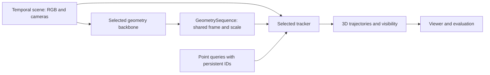

# 3D point tracking: candidates and proposed Ontic interface

Research date: 2026-09-17. Proposal for discussion; no tracker implementation or
local model benchmark has been performed. The working assumption is synchronized
RGB video with one or more views, supplied or estimated geometry, and offline
inference for the first integration. Point-cloud-only input is covered separately.

**Recommendation.** Evaluate **MVTracker and TAPIP3D first**, using identical cached
geometry. Add **TrackCraft3R** for dense cloud trajectories, and **SpatialTrackerV2**
as an established single-view alternative. Keep geometry estimation independently
selectable. This ordering reflects fit to Ontic and released implementations, not a
claim that one method wins every benchmark.

**What “tracking a point cloud” should mean here.** A query identifies a physical
surface point at a particular time. The result follows that same point through
time, including estimated positions during occlusion. Independently reconstructing
a cloud at each timestep does not establish those identities. A sampled point's
array index, voxel index, or nearest neighbour in the next frame is not its identity.

The main candidates use RGB features together with geometry. Their ability to
produce 3D trajectories does not imply they accept arbitrary XYZ-only scans.

**Candidate shortlist**

| Model | Input / tracking setting | Why evaluate it | Integration limits |
| --- | --- | --- | --- |
| [MVTracker](https://github.com/ethz-vlg/mvtracker), ICCV 2025 | Synchronized multi-view RGB-D, calibrated cameras, world-space queries | Closest match to the desired multi-view tracker after a geometry backbone; released weights and evaluation | Scene normalization matters; released evaluation predictor accepts batch size 1 and produces aggregate visibility |
| [TAPIP3D](https://github.com/zbw001/TAPIP3D), NeurIPS 2025 | One RGB-D video, intrinsics and poses; tracks in persistent world space | Strong modular baseline; can consume Ontic geometry instead of running MegaSAM | Native tracker is monocular; multi-view reconstruction as input does not make its correspondence reasoning multi-view; CUDA pointops2 / torch-scatter dependencies |
| [TrackCraft3R](https://github.com/cvlab-kaist/TrackCraft3r), May 2026 preprint | Monocular RGB plus depth/cameras; dense reference-frame trajectories | Particularly relevant if the target is a densely tracked cloud; released checkpoint, training and evaluation; documented DA3/ViPE preprocessing | Wan-based model with its own features; native queries are tied to a reference image; arbitrary query times need adaptation |
| [SpatialTrackerV2](https://github.com/henry123-boy/SpaTrackerV2), ICCV 2025 | Monocular RGB, or external RGB-D and camera poses | Compare both tracker-only and joint geometry/tracking use | Released quick start is offline; online release remains unchecked in README; not a native synchronized multi-view tracker |
| [Track4World](https://github.com/TencentARC/Track4World), ECCV 2026 | Monocular video; dense tracking with DA3/Pi3 geometry variants | Useful second dense candidate, with released weights and world-space output | More tightly coupled to its geometry pipeline; public variants are not interchangeable Ontic feature heads |
| [MV-TAP](https://github.com/cvlab-kaist/MV-TAP), CVPR 2026 | Multi-view RGB/cameras and corresponding per-view queries; 2D trajectories | Genuine cross-view tracking alternative; code and checkpoint links available | Needs an explicit triangulation/depth-lifting adapter for 3D, including cross-view query initialization |
| [CoTracker3](https://github.com/facebookresearch/co-tracker) + depth lifting | RGB video plus downstream depth/cameras | Simple diagnostic baseline; available online and offline models | Lifting an occluded pixel can sample the occluder's depth; this is not a reliable hidden-point 3D estimate |

MVTracker's paper reports median errors of **3.1 cm on Panoptic Studio** and
**2.0 cm on DexYCB** under its evaluation settings. These are not general expected
errors for Ontic datasets: the depth sources and camera setups matter. Its model
uses overlapping temporal windows; that alone does not establish a zero-lookahead
streaming API. [Project and evaluation context](https://ethz-vlg.github.io/mvtracker/).

For TrackCraft3R, the reported comparisons use Sim(3)-aligned trajectories and a
different evaluation protocol from the conventional TAPVid-3D tables. Its scores
must not be placed beside TAPVid-MV or conventional TAPVid-3D scores as if they were
one leaderboard. [Paper](https://arxiv.org/html/2605.12587v1).

**The most relevant new benchmark**

[TAPVid-MV](https://arxiv.org/html/2609.01899v1), submitted September 1, 2026,
evaluates moving multi-camera scenes. Table 4 reports the following overall
world-space location accuracy, averaged over seven subsets; higher is better:

| Tracker using shared VGGT-Omega geometry | World-space accuracy |
| --- | ---: |
| TAPIP3D | 22.8 |
| MVTracker, released baseline | 22.0 |
| MVTracker, benchmark finetuned variant | 23.7 |
| CoWTracker + lifting | 20.8 |
| MV-TAP + lifting | 19.1 |

These are **location-accuracy scores, not AJ or centimetres**. The finetuned row is
a distinct setting, not the default MVTracker checkpoint. The paper identifies
geometry recovery as a major limitation. Its prose and table contain small
inconsistencies; the numbers above are taken from Table 4.

The [project page](https://tapvidmv.github.io/) still labels downloadable data and
code “soon”, although interactive sequence recordings are available. Use its
published results to guide selection; verify the actual release before planning
a reproducible local benchmark around it.

**Other work worth retaining**

- [DELTAv2](https://github.com/snap-research/DenseTrack3Dv2) and
  [DELTA](https://github.com/snap-research/DELTA_densetrack3d): dense RGB-D baselines.
  DELTAv2 provides checkpoint links despite a stale release TODO. Useful if dense
  throughput becomes the deciding criterion.
- [OmniX](https://github.com/yanqinJiang/OmniX): a released joint multi-view 4D model.
  Relevant as a combined geometry/tracking provider; its README recommends
  Hopper/Blackwell GPUs for FlashAttention-3. I would keep it experimental initially.
- [Trace Anything](https://github.com/ByteDance-Seed/TraceAnything): official code
  and [weights](https://huggingface.co/depth-anything/trace-anything) are available.
  Predicts continuous trajectory fields; useful as an experimental joint provider.
  Released examples were tested with at least 48 GB VRAM; the script expects
  temporally ordered images and downsamples inputs exceeding 40 images. Code is
  Apache-2.0, weights CC BY-NC 4.0.
- [D4RT](https://d4rt-paper.github.io/): relevant queryable 4D representation. This
  review did not verify official downloadable weights. Community reproductions
  should be evaluated under their own names.
- [ERNet](https://www.guangzhaohe.com/ernet/): the relevant branch for XYZ-only
  deforming object sequences. It registers a source shape to partial/noisy point
  sequences, evaluated on DeformingThings4D and D-FAUST. That source-shape assumption
  differs from arbitrary scene point tracking. The project has a code link, but
  this review could not verify its implementation/checkpoint availability.
- [MER-Tracker](https://openaccess.thecvf.com/content/CVPR2026/html/Chang_MER-Tracker_Towards_High-Speed_3D_Point_Tracking_via_Multi-View_Event-RGB_Hybrid_CVPR_2026_paper.html)
  uses event/RGB hybrid cameras; relevant only if those sensors are in scope.

GitHub repositories, primary papers, project pages, benchmark tables, and X/Twitter
searches were checked. X searches did not yield directly verifiable technical
evidence in this session; no ranking above relies on social engagement or reposts.

**How this fits the existing code**

The current [backbone contract](../packages/ontic-nn/src/ontic_nn/wrappers/common.py)
is `images[B,V,3,H,W] -> BackboneOutput`, with depth on its own grid,
camera-to-world matrices, normalized intrinsics, and optional patch features.
Its camera getters prefer supplied GT cameras. Its `depth_conf` is an `exp(x)+1`
score, not a probability. These details should remain explicit at the tracking
boundary.

The [dataset layer](../packages/ontic-data/src/ontic_data/temporal.py) already exposes
temporal scenes and per-frame cameras. The
[viewer source](../packages/ontic-viz/src/ontic_viz/backbone_viewer/data_source.py)
currently returns one all-camera `Frame` at a time. The
[viewer runner](../packages/ontic-viz/src/ontic_viz/backbone_viewer/runner.py)
currently aligns each result for display. Tracking needs a sequence loader and a
stable coordinate frame before inference.

Add a sibling namespace `ontic_nn.trackers` with `TRACKERS`, `TrackerConfig.build()`,
`TrackerBase(nn.Module)`, and `TrackerOutput`. Follow the existing registry,
checkpoint, cache, freezing and lazy-import conventions. A tracker should not
inherit depth-head freezing switches, `encoder_dim`, or mandatory patch outputs.
Keep geometric operations and reusable trajectory containers in `ontic_lib` if
needed by more than the neural wrappers. `ontic_lib.tracking` already means metrics
logging, so avoid placing point tracking there.

The proposed pipeline is:



**Proposed public contract**

Use explicit **batch, time, view** axes. Single-view input retains `V=1`. For a
first version, accept a rectangular synchronized clip with stable view ordering;
reject missing frames instead of treating padded black images as observations.
The following is a schema sketch, not an implemented API:

```python
@dataclass
class GeometrySequence:
    depth: Tensor                 # float [B,T,V,Hd,Wd], camera-z
    depth_valid: Tensor           # bool  [B,T,V,Hd,Wd]
    extrinsics: Tensor            # float [B,T,V,4,4], camera-to-world
    intrinsics: Tensor            # float [B,T,V,3,3], normalized
    frame_ids: tuple[str, ...]     # one common world-frame identifier per batch item
    units: tuple[str, ...]         # each: "meters" or "arbitrary"
    provenance: dict               # depth/pose source, alignment, model revisions

@dataclass
class PointQueries:
    ids: Tensor                   # int64 [B,N], unique within each sequence
    time: Tensor                  # int64 [B,N], index into supplied clip
    xyz_world: Tensor             # float [B,N,3], in geometry's frame/units
    source_view: Tensor | None    # int64 [B,N], optional image provenance
    source_uv: Tensor | None      # float [B,N,2], normalized pixel centers

class TrackerBase(nn.Module):
    def forward(
        self,
        images: Tensor,           # float [B,T,V,3,H,W], RGB in [0,1]
        queries: PointQueries,
        *,
        geometry: GeometrySequence,
    ) -> TrackerOutput: ...

@dataclass
class TrackerOutput:
    ids: Tensor                   # int64 [B,N], same IDs and order as queries
    tracks_world: Tensor          # float [B,T,N,3], geometry's frame/units
    valid: Tensor                 # bool [B,T,N], supported finite estimate
    visibility: Tensor | None     # float [B,T,N], native aggregate/query-view score
    visibility_scope: str         # "any_view", "query_view", or "unavailable"
    visibility_per_view: Tensor | None  # float [B,T,V,N], if available
    metadata: dict                # visibility provenance, thresholds, timings, revision
```

`source_uv` and `source_view` are paired fields. Image queries can be lifted to
`xyz_world` through geometry; cloud queries can supply XYZ directly. Reject invalid
query depths. For monocular models a cloud query needs a valid visible source view;
select it explicitly using projection/depth agreement and record the choice.
Sampling a grid or FPS cloud is a separate query-construction helper.

Use Ontic's existing normalized pixel-center convention `(x+0.5)/W, (y+0.5)/H`.
An adapter targeting integer-centered coordinates converts both query coordinates
and principal points consistently. A resize/crop adapter records its image
transform, updates intrinsics, and maps any image outputs back to the public grid.
Depth values themselves are not multiplied by the image resize ratio.

The output always refers to the geometry's shared world frame. “Arbitrary” means
one consistent scale for the whole clip, not an independent scale per frame.
Occluded estimates can remain valid. Missing estimates use `valid=False`; unknown
visibility is not equivalent to occlusion. An in-bounds projection alone does not
prove visibility. Preserve native aggregate scores and label any per-view
visibility derived from depth tests separately. Do not reuse `depth_conf` as track
confidence or assume scores are calibrated across models.

A dense model can flatten its reference grid into `N` persistent query identities,
retaining source pixels/grid shape in metadata. Cap/query-sample for the viewer;
never silently rebuild identities by resampling each output cloud. Multiple query
times may require multiple reference passes. Expose that cost in capabilities.

For a model that estimates its own geometry, provide a separate
`reconstruct_and_track(images, image_queries)` entry point returning both
`GeometrySequence` and `TrackerOutput`. It must not silently replace geometry
supplied to `forward`. XYZ-only registration can use a separate input protocol
while sharing the trajectory result schema.

**The backbone-to-tracker adapter needs deliberate geometry handling**

1. Build or cache a `BackboneOutput` for each time. Running the existing wrapper
   over `[B*T,V,...]` is an execution shortcut only; it provides no temporal
   consistency guarantee. Do not flatten time into views by default.
2. Select the depth and camera sources together. Predicted depth and GT cameras
   cannot be mixed merely because `get_extrinsics()` prefers GT. Use the intended
   alignment policy and retain its provenance.
3. Establish a shared world frame. Independently inferred frame reconstructions
   may have different similarity gauges. Register them using calibration or
   cross-time geometry before stacking. A single global similarity transform
   suffices only when the original reconstruction is already coherent.
4. Separate that registration from evaluation/display alignment. Avoid fitting a
   fresh GT trajectory alignment at every timestep; it can hide motion errors.
   Make metric scale fitting coherent across the clip and report residual drift.
5. Resample RGB/depth/masks onto the grid required by the tracker, using mask-aware
   depth handling. Preserve the original cameras and the transformation record.
6. Pass geometry and images; let each pretrained tracker use its own feature
   encoder initially. The four arbitrary backbone patch taps are not a pretrained
   compatibility contract. Feature reuse needs a model-specific adapter and likely
   training, not just a matching channel count.

For MVTracker specifically, its
[released predictor](https://github.com/ethz-vlg/mvtracker/blob/main/mvtracker/models/evaluation_predictor_3dpt.py)
expects RGB/depth axes `[B,V,T,...]`, pixel intrinsics, world-to-camera `3x4`
extrinsics, and `[B,N,4]` queries ordered `(t,x,y,z)`. The Ontic adapter must permute
axes, denormalize intrinsics, invert c2w and retain the first three rows. It must
handle the upstream `B=1` restriction explicitly. The output includes both
thresholded `vis_e` and `vis_e_as_prob`; preserve the latter. Undo any scene
normalization on trajectories before returning them.

**Capabilities and packaging**

Give configs a small capability descriptor available before loading weights:
native multi-view support, required inputs, query kinds/times, dense support,
visibility semantics, batching restriction, and execution mode. Distinguish
offline, windowed with lookahead, and causal streaming. A future stream API needs
explicit state, reset, query insertion and finalized timestep semantics.

Mirror `checkpoint_path`, `cache_dir`, `allow_download`, `long_side`, and a tracker
freeze switch. Keep upstream installations optional. Some repositories use generic
top-level names such as `models`; check import collisions before loading several
into one process. Pin upstream revisions and record checkpoint identities.

Verified licensing observations: TAPIP3D includes an
[Apache-2.0 license](https://github.com/zbw001/TAPIP3D/blob/main/LICENSE);
MVTracker's [weight card](https://huggingface.co/ethz-vlg/mvtracker) says Apache-2.0,
but this review found no root code LICENSE at the inspected path. SpaTrackerV2's
root LICENSE was likewise not found. Track4World links a custom Tencent license.
Record code and weight terms separately when packaging; the labels above are not
claims about every bundled dependency.

**Evaluation and integration order**

Start with short clips from the existing depth-bearing datasets (`hocap`,
`physinone`, `synthrobot`) to validate geometry and display, then add public tracking
labels. Available depth does not imply available point-trajectory ground truth.

| Stage | Comparison | What it establishes |
| --- | --- | --- |
| Geometry reference | GT/sensor depth + calibrated cameras; MVTracker vs TAPIP3D vs lifted CoTracker3 | Tracker differences without depth-backbone variation |
| Backbone comparison | Cached DA3 / VGGT-Omega / Pi3X geometry with the same queries and tracker | Sensitivity to depth, scale and camera errors |
| Dense tracks | TrackCraft3R, then Track4World or DELTAv2 | Coverage, drift and memory at practical cloud density |
| Multi-view value | Same clips and query IDs with 1, 2 and 4 cameras | Whether extra cameras help, particularly across occlusion |

Use the [MVTracker evaluation datasets](https://github.com/ethz-vlg/mvtracker#datasets)
for a currently documented multi-view starting point. Use
[TAPVid-3D](https://tapvid3d.github.io/) for monocular 3D evaluation and
[PointOdyssey](https://pointodyssey.com/) for long trajectories. Add TAPVid-MV when
its full release can be retrieved. Keep dataset splits and evaluation protocols
separate.

Measure metric 3D trajectory error where scale is known, protocol-defined
AJ3D/APD3D/OA, visible versus occluded error, static versus dynamic error,
reprojection consistency, latency and peak VRAM. Report geometry time separately
from tracking time, and also end-to-end. Fix frames, resolution, query count,
depth source, camera source and alignment when comparing trackers.

The first implementation should consist of the common contract, geometry/query
adapters, MVTracker and TAPIP3D wrappers, and viewer trajectory playback. A lifted
CoTracker3 baseline is useful for diagnosis. Then add dense and joint models once
the same geometry and query identities can be compared reliably.
